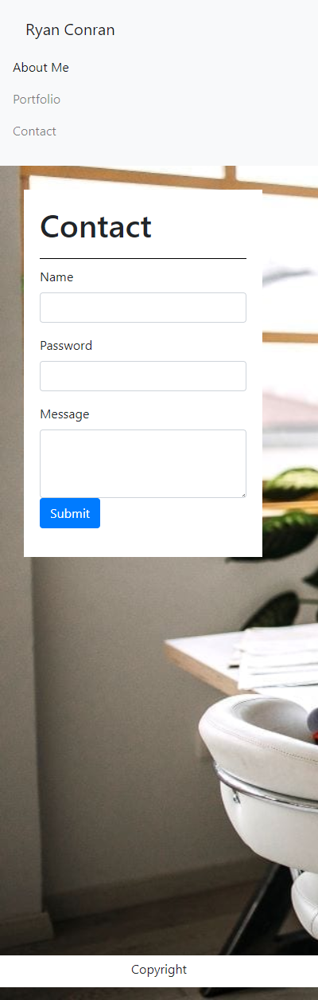

# Portfolio

Motivation:  The purpose of this project was to build a functioning html from the ground up to host an about me page, a portfolio page and a contact page.  These pages were then sytled using Bootstrap and 
a grid based layout.

Project Requirements:

- Nav-Bar is uniform across all htmls
- Links are included to each page
- All Links Work
- Name image and Bio included in applicable pages
-Utilizes Bootstrap Components and Grid System

Screenshots of Deployed Project

 

 
